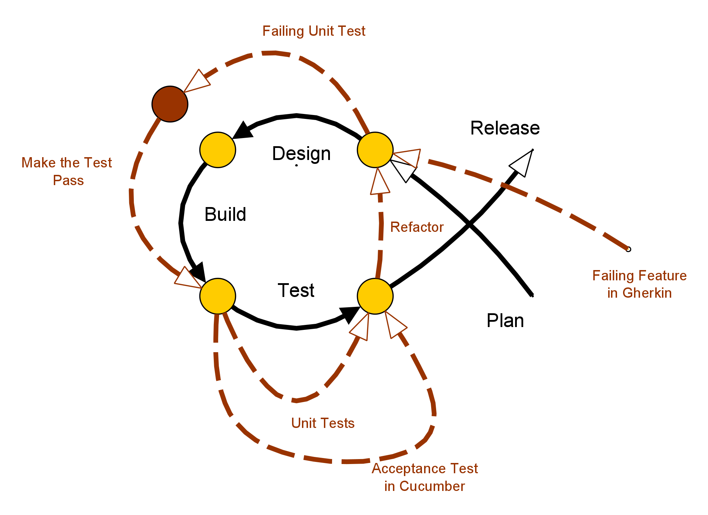
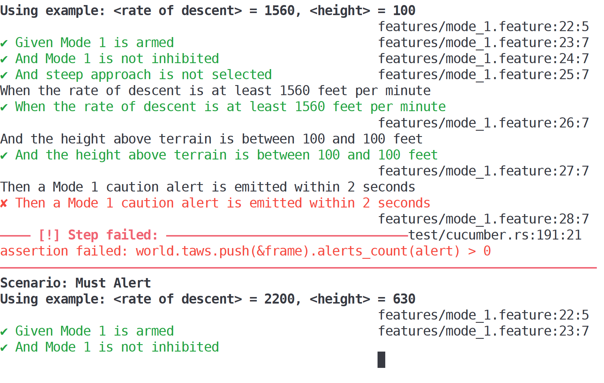
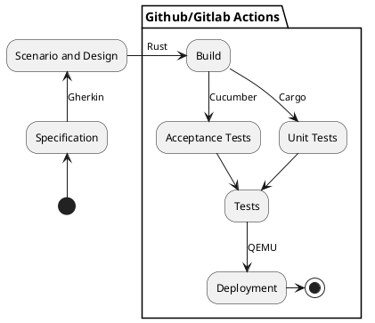

# Roadmap EmbDevOps

The target is to show a complete continuous integration/continuous development
cycle (CI/CD) with the corresponding toolchain to support this approach.



To show the capabilities of this approach and the technologies supporting it we
want to demonstrate a small piece of avionics software created with this approach
on the base of a formal specification used in real avionics equipment.

The following technologies will be used and explained in the project:


## Gherkin for Scenario based Acceptance Testing

In the Behavior Driven Development (BDD) scenarios form the first stage of the process; The system is described in scenarios percepted from an outside view on it. 
To structure those tests the [Gherkin
language](https://cucumber.io/docs/gherkin/reference/) is used. This is a formalisation on structured sentences with the goal of allowing automated evaluation for traceable testing, written in an easy to read and comprehensible format.

A Gherkin sentence is prefexed by certain keywords that describe context
(`Given`), events (`When`) and outcomes (`Then`). Together these words can
build sentences, which accumulate to scenarios:

```gherkin
Scenario: Start button pressed
  Given the main windows is selected
  When the "Start"-button is pressed
  Then the window "Loading..." will appear
  And the window "Loading..." will be focussed.
```

The bridge to go from this structured, but still natural and understandable language to code and tests will be created by a interpreter. However, before we can use that, we have to look at what kind of code we want to create.


## Rust

As a newer programming language with many by-design security features [Rust](https://www.rust-lang.org/) provides a very solid base for safety & security critical applications that the avionics sector requires. For example memory-safety and thread-safety are guaranteed at compile-time by the rich type system and ownership model.  With its well integrated package manager [`Cargo`](https://doc.rust-lang.org/cargo/) detailed documentation and comprehensive testing capabilities it is well equipped to be integrated into the CI/CD-cycle.


## Testing 

To translate the Gherkin sentences into executable tests we use the [Gherkin](https://cucumber.io/docs/gherkin/reference/) parser and test framework [Cucumber](https://cucumber.io/), to be precise the Rust flavoured ["cucumber-rust"](https://lib.rs/crates/cucumber_rust). This enables us to generate test cases and run these automatically. Up on execution, they generate output like in the following figure. It tells us which tests succeded, which failed and which hasn't been implemented yet:



Together with these tests which can encompass bigger parts of the code base we will be using unit tests for smaller code fragments that are less complex. These will be created by the package manager of Rust [Cargo](https://doc.rust-lang.org/cargo/) with `cargo test`.


## Github/Gitlab actions 

To automate and streamline the process further this testing approach will be used in the [GitHub flow](https://guides.github.com/introduction/flow/). The proven GitHub process of versioning, testing and releasing suits the ,overall CI/CD process well. For the automation - which is required in CI/CD - [GitHub Actions](https://github.com/features/actions) will be used. Using it, we can run our Gherkin and unit tests in the cloud, everytime code changes are pushed automatically. Furthermore, said mechanisms are used to guide humans while reviewing pull requests with lints and test reports. 


## QEMU 

In the last step the created program will be deployed to a emulated platform within [QEMU](https://www.qemu.org/) to find out if the tests still run successfully. This also increases the confidence before releasing a new version. Last but not least it allows testing for bare metal platforms. This step should be integrated into the Github actions script.

